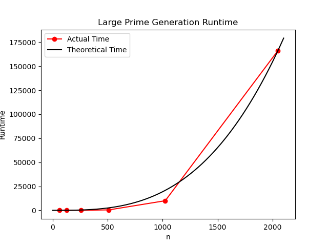
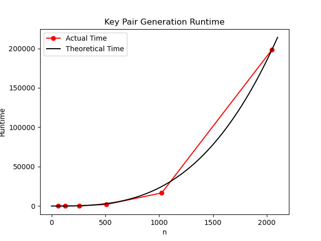

# Project Report - RSA and Primality Tests

## Baseline

### Design Experience

The ModExp algorithm takes as input integers *x, y,* and *N*. It outputs *x^y mod N.*
It reduces the amount of time it takes to perform a modular exponent by performing a
modulo operation on each power of 2 that makes up the exponent, *y.*  

#### Modular Exponentiation

| x | y | N | z | Return value |
|---|---|---|---|--------------|
| 3 | 6 | 21 | 6 | 15|
| 3 | 3 | 21 | 3 | 6 |
| 3 | 1 | 21 | 1 | 3 |
| 3 | 0 | 21 |   | 1 |

>fermat(N, k): #Test positive integer *N* *k* times for primality  
> &nbsp;&nbsp; a = set of *k* positive integers less than *N* - 2  
> &nbsp;&nbsp; for all in a:  
> &nbsp;&nbsp; &nbsp;&nbsp; if ModExp(a, N - 1, N) == 1:  
> &nbsp;&nbsp; &nbsp;&nbsp; &nbsp;&nbsp; return prime  
> &nbsp;&nbsp; &nbsp;&nbsp; else:  
> &nbsp;&nbsp; &nbsp;&nbsp; &nbsp;&nbsp; return composite  

>genPrime(nBits): #nBits is the number is bits long the prime must be  
> &nbsp;&nbsp; while true:  
> &nbsp;&nbsp; &nbsp;&nbsp; num = randomBits(nBits)  
> &nbsp;&nbsp; &nbsp;&nbsp; if fermat(num) == true:  
> &nbsp;&nbsp; &nbsp;&nbsp; &nbsp; return num  
> &nbsp;&nbsp; &nbsp;&nbsp; else:  
> &nbsp;&nbsp; &nbsp;&nbsp; &nbsp;&nbsp; continue  

I will track my empirical data by timing how long it
takes to perform each function given inputs of various
lengths.
 

### Theoretical Analysis - Prime Number Generation

#### generate_large_prime
```py
def mod_exp(x: int, y: int, N: int) -> int:
    if y == 0:
        return 1
    z = mod_exp(x, y // 2, N)
    if (y % 2 == 0):
        return z ** 2 % N
    else:
        return x * z ** 2 % N

def fermat(N: int, k: int) -> bool:
    """
    Returns True if N is prime
    """
    if N % 2 == 0 and N > 2:
        return False
    for i in range(k):
        rand_num = random.randint(1, N - 1)
        modulation = mod_exp(rand_num, N - 1, N)
        if modulation != 1:
            return False
    return True

def generate_large_prime(n_bits: int) -> int:
    while True:
        prime_num = random.getrandbits(n_bits)
        primality: bool = fermat(prime_num, 20)
        if primality == True:
            if prime_num.bit_length() == n_bits:
                return prime_num
        else:
            continue
    """Generate a random prime number with the specified bit length"""
    return 4  # https://xkcd.com/221/
    #Clever^. This feels like the time for a Deus Ex reference, but I don't have any. What a shame.
```

#### Time 

generate_large_prime() references fermat(), which references mod_exp().

For mod_exp(), if we measure *n* as the bit length of *y*, we know that we will need about
*log(y) = n* layers of recursion. Within each layer, we will need to perform a multiplication
of two integers that are less than or equal to the size of *y*, giving both numbers
a size of *O(n)*. Multiplying two n-bit numbers is *O(n^2)*, and if we multiply that by
the amount of recursive calls we make, we have a total complexity of *O(n^3)*.

We can then move on to fermat(). fermat() uses random.randint(1, N - 1), which has a complexity
of *O(n)* where *n* is the range between _1_ and _N - 1_ in binary. This is because randint() generates
*O(log(range))* random bits, and then adds the result to the lower number in the range.
after this, it uses the random integer in the mod_exp() algorithm. These are done sequentially,
and therefore mod_exp()'s time complexity dominates because it is higher. If we assume the value of _k_
to be a constant-- especially since we are using it as a constant in the performance tests--
this means we have _k_ iterations of _O(n^3)_, yielding a time complexity of _O(n^3)_.

generate_large_prime() uses random.getrandbits() to generate a random number. If we tell it to generate
_n_ random bits, we have a time complexity of _O(n)_. We then perform fermat(), which is _O(n^3)_,
and then check a boolean value, which is _O(1)_, and then check the length of
the prime number we generated, which is _O(n)_. We can not tell how many attempts it will take to
successfully generate a prime number of the desired length, so our best estimation of time complexity lies
in the complexity of one iteration, which is _O(n^3)_. Therefore, the final
time complexity is **O(n^3)**.

#### Space

Returning to mod_exp needing *O(n)* layers of recursion, we can store the multiplication result
at each layer in a buffer of at most size *2n*, multiplying an n-bit number
by another is only at most *2n* in size for the result. This leads to
a level complexity of *O(n)*. Multiplying that by *n* recursions,
we have a total memory complexity of *O(n^2)*.

fermat() will clear its memory after ever iteration of its loop, so we can treat the memory used for
counting iterations as a constant. Generating a random integer between _1_ and _N - 1_
will use _O(n)_ memory because it will need to allocate _n_ bits to iterate over. mod_exp()'s
space complexity is higher, so it dominates and leaves fermat() with the same complexity of _O(n^2)_.

generate_large_prime() uses _O(n)_ space where _n_ is the bit length for the prime it needs to output.
getrandbits() will need to store its output in _n_ bits, and the condition checks are constant and then _O(logn)_
bits for comparing the bit length-- which will be counted in binary-- of the generated prime to the desired number of bits.
This means that mod_exp()'s space complexity wins again, and the overall space complexity for generating prime numbers
is **O(n^2)**.

### Empirical Data

| N    | time (ms) |
|------|-----------|
| 64   | 3.98      |
| 128  | 25.34     |
| 256  | 64.64     |
| 512  | 474.19    |
| 1024 | 9992.62   |
| 2048 | 166231.09 |

### Comparison of Theoretical and Empirical Results

- Theoretical order of growth: **O(n^3)** 
- Measured constant of proportionality for theoretical order: **1.935184584e-5**
- Empirical order of growth (if different from theoretical): 
- Measured constant of proportionality for empirical order: 



Empirical order of growth matches theoretical order of growth.

## Core

### Design Experience
Extended Euclid takes two positive integers, _a_ and _b_ where _a_ >= _b_ >= 0
and outputs values _x, y,_ and _d_ where _d_ is the greatest common divisor
of _a_ and _b_, and _ax_ + _by_ = _d_. This is used for finding the second
key in an RSA pair, where the first key is (_N, e_) where _N = pq_ and _n = (p - 1)(q - 1)._
To generate a key pair, generate two large primes, _p_ and _q_. Multiply those together to get _N_.
Multiply _p - 1_ and _q - 1_ to get _n_. Find a number that is coprime to _n_ by iterating through a list of prime
numbers, and passing them through Euclid's Extended Algorithm. The goal is to find the smallest prime number that is
coprime with _n_. The number that is found is _e_. Two numbers are coprime when their
greatest common divisor is 1. When Euclid's Extended Algorithm returns 1 as the third value in its output, the value
tested for *e* will be coprime with *n*. By finding _e_ using Euclid's extended algorithm, we also find the values _x_
and _y_ such that _nx + ey = 1_. In this case, _y_ will be the value that will be used for the private key in the
keypair. If _y_ is negative, add _n_ to its value to get a positive value that will still work in the key pair. The
private key is therefore _(N, y)_ and the public key is _(N, e)_.

#### Euclid's Extended Algorithm
p = 7  
q = 11  
N = 77  
n = 60  
e = 7

|a|b|x|y|d|Return value 1|Return value 2|Return value 3|
|-|-|-|-|-|--------------|--------------|--------------|
|60|7|-1|2|1|2|-17|1|
|7|4|1|-1|1|-1|2|1|
|4|3|0|1|1|1|-1|1|
|3|1|1|0|1|0|1|1|
|1|0||||1|0|1|

60 * 2 + 7 * -17 = 1  
In the case of finding an RSA Key, 60 would be added to the value of -17, to get 43, generating the key pair (77, 7) and
(77, 43).

>genPair(nBits):  
> &nbsp;&nbsp;p = genPrime(nBits)  
> &nbsp;&nbsp;q = genPrime(nBits)  
> &nbsp;&nbsp;N = p * q  
> &nbsp;&nbsp;n = (p - 1) * (q - 1)  
> &nbsp;&nbsp;while true:  
> &nbsp;&nbsp;&nbsp;&nbsp;e = nextLowestPrime()  
> &nbsp;&nbsp;&nbsp;&nbsp;x, y, d = extEuc(n, e)  
> &nbsp;&nbsp;&nbsp;&nbsp;if d == 1:  
> &nbsp;&nbsp;&nbsp;&nbsp;&nbsp;&nbsp;return N, e, y

I can track how much time it takes to generate key pairs by timing
my code when given inputs of various lengths


### Theoretical Analysis - Key Pair Generation

```py
def generate_key_pairs(n_bits) -> tuple[int, int, int]:
    """
    Generate RSA public and private key pairs.
    Randomly creates a p and q (two large n-bit primes)
    Computes N = p*q
    Computes e and d such that e*d = 1 mod (p-1)(q-1)
    Return N, e, and d
    """
    p = prime.generate_large_prime(n_bits)
    q: int
    while True:
        q = prime.generate_large_prime(n_bits)
        if q == p:
            continue
        else:
            break
    N = p * q
    p_and_q = (p - 1) * (q - 1)
    for i in primes:
        x, y, d = ext_euclid(p_and_q, primes[i])
        if d == 1:
            return N, primes[i], y
    raise Exception("None of the provided primes worked with p and q.")

def ext_euclid(a: int, b: int) -> tuple[int, int, int]:
    x, y, d = ext_euclid_recursion(a, b)
    if y < 0:
        y += a
        return x, y, d
    else:
        return x, y, d

def ext_euclid_recursion(a: int, b: int) -> tuple[int, int, int]:
    if b == 0:
        return 1, 0, a
    x, y, d = ext_euclid_recursion(b, (a % b))
    return y, (x - (a // b) * y), d

```

#### Time 

Generating two prime numbers of bit size _n_ is _O(n^3)_ as established in the baseline analysis. _N = p * q_ and
_p_and_q = (p - 1) * (q - 1)_ will both be _O(n^2)_ because multiplying an _n_-bit number by an _n_-bit number is will
require _O(n^2)_ time. Since we can not predict how many prime numbers will need to be tested before we find one coprime
with _p_and_q_, we will assume the number of iterations performed by the forloop is constant.

ext_euclid() will recurse approximately _O(n)_ times, because every two recursions will decrease the length of both _a_
and _b_ by one bit each. Each layer of recursion will also perform a division, which is _O(n^2)_. This means that
ext_euclid() has a time complexity of _O(n^3)_, which is equal to the time complexity of generating a prime number of _n_
bits. Since _O(n^3)_ is the largest complexity in generate_key_pairs, its final time complexity is **O(n^3)** where _n_
is the number of bits that each prime factor of _N_ will be in length.

#### Space

ext_euclid() will again need _O(n)_ recursions, and since intermediate results of division can again be stored in a buffer
of length _O(n)_ bits, then the needed space for ext_euclid is _O(n^2)_. This is equal to the other major step in
generating key pairs, generate_larg_prime(), therefore the total space complexity of generating a key pair is **O(n^2)**
where _n_ is the number of bits each prime factor of _N_ will be in length.

### Empirical Data

| N    | time (ms) |
|------|-----------|
| 64   | 6.98      |
| 128  | 68.86     |
| 256  | 298.05    |
| 512  | 2085.5    |
| 1024 | 16636.14  |
| 2048 | 198569.38 |

### Comparison of Theoretical and Empirical Results

- Theoretical order of growth: **O(n^3)** 
- Measured constant of proportionality for theoretical order: **2.31165182777e-5**
- Empirical order of growth (if different from theoretical): 
- Measured constant of proportionality for empirical order: 



Empirical order of growth matches theoretical order of growth.

## Project Review

For my project review I talked with James Teuscher for my project review. We went over time and space complexities and
implementation strategies. We both took most of our source code from the text book because so much of it is written very
in pseudocode. We agreed on our theoretical time complexities, however, James did find that for his implementations of
prime and key generation, his time complexities were between O(n^2.65) to O(n^2.9). My strategy of cutting down on
runtime in my prime number test by immediately checking for even numbers was new to him. I had not done my timing yet,
but I had passed all the tests.

James was less sure of his theoretical analysis of his runtimes. I understood that as I had struggled with that the
first time I took this class. I was more sure of mine because I had read the textbook more closely and gotten my time
complexities and analysises directly from it.

